# Acme Fitness (Gym Management System)

# Tools and Technology Used:

### Frontend: React.js, NextUI
### Backend: GoLang
### Database: PostgreSQL (Deployed on Amazon RDS)
### Deployment: Amazon EC2 Auto scaled cluster with Load balancing (Deployed using Docker Image)

## Architecture Diagram:

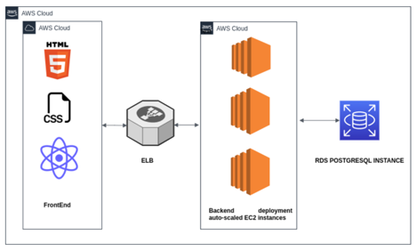

## Deployment Diagram:

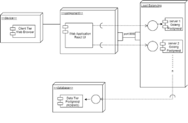

## Use Case Diagram:
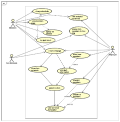

## Component Diagram:

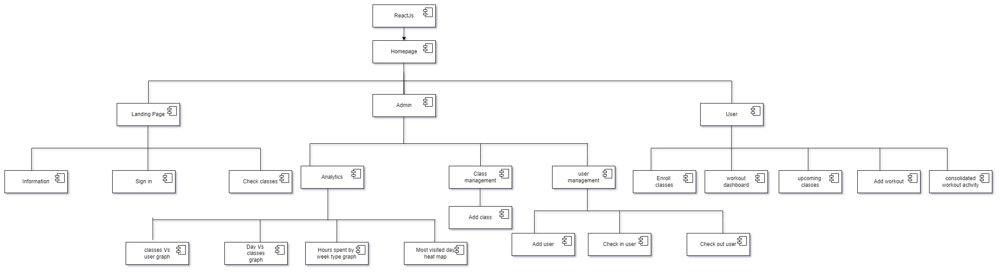

## DB Schema:
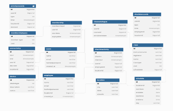

## Auto Scaled EC 2 Instances:

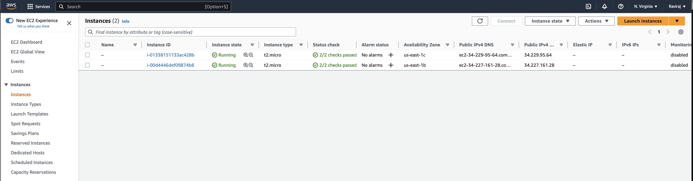

## Auto-scaling-instances:

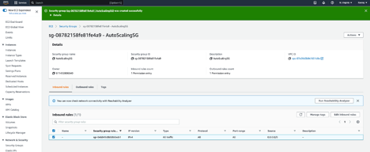

## Autoscaling group:
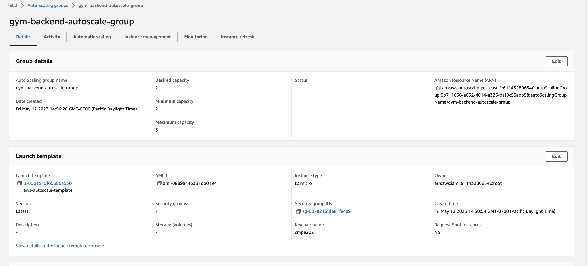

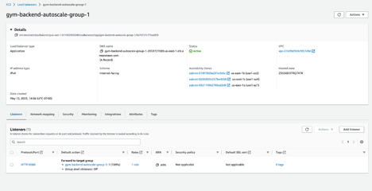

## Load Balancer:
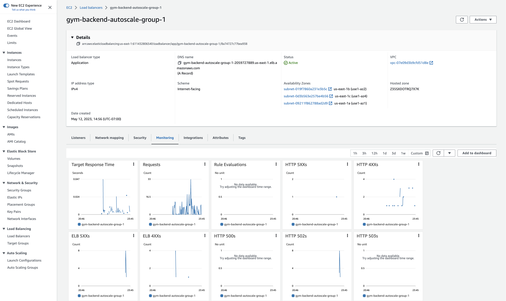

## UI Wireframes:
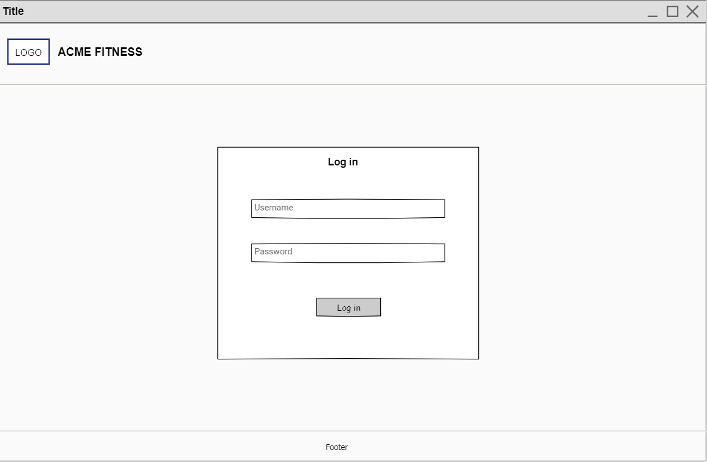

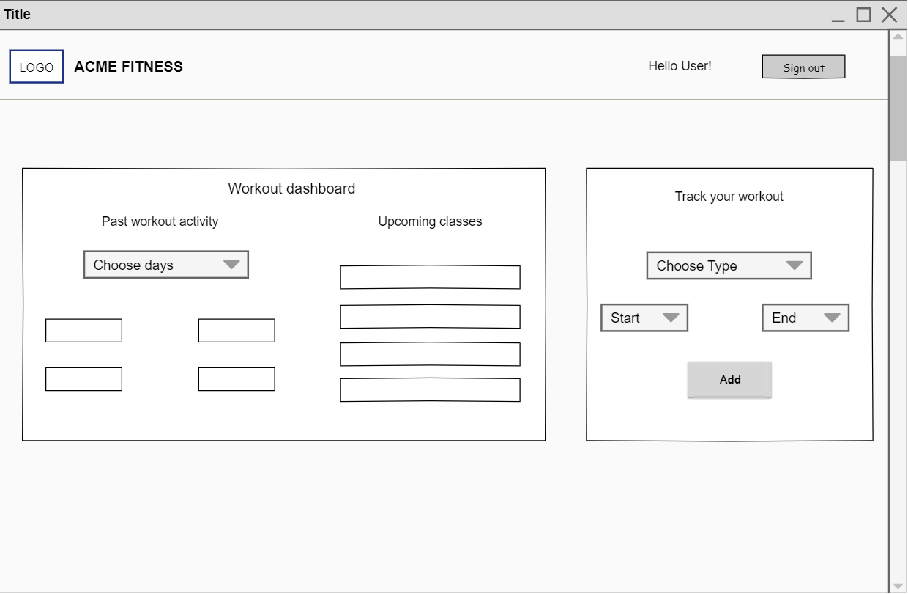
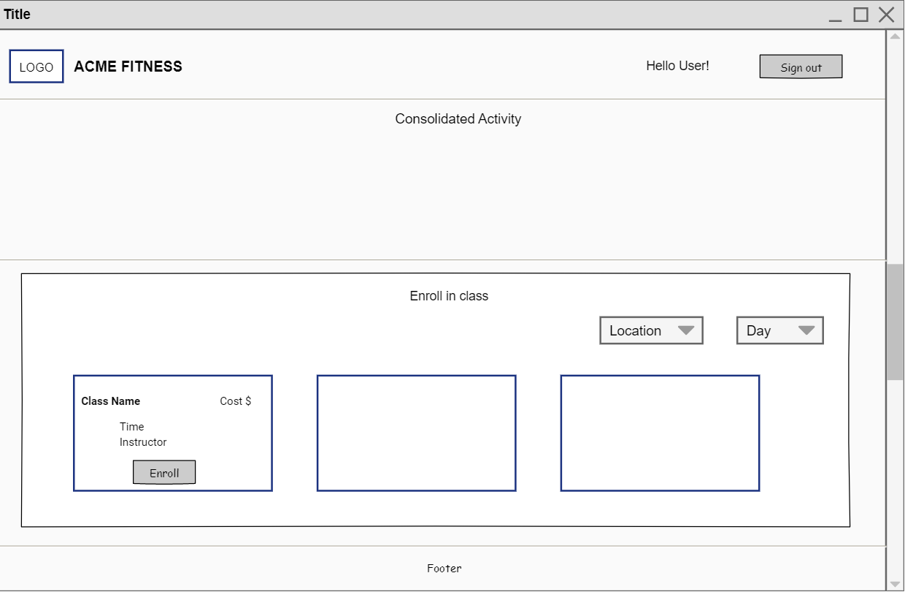
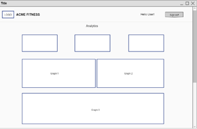
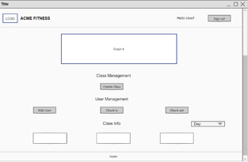

