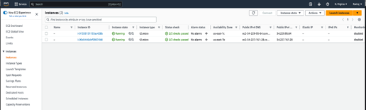

# Acme Fitness (Gym Management System)

# Team Members
1. Chiruhas
2. Priyanka 
3. Raviraj 
4. Jaswanth

# XP Core Values

## Simplicity:
This core value was held by Chiruhas. Held responsible for maintaining the workflow of everyone in our team. Been responsible for developing the GUI for our web application. As GUI holds the implementation of all the API’s maintaining the transparency for each API helped us to maintain reliability and integrity for our application. Moreover, I have also taken care of maintaining the measures for building each API.

## Communication:
This core value is held by Priyanka. Held responsible for managing the operations that are performed during the course of our project. At each level of project, this core value made sure that all the deliverables of the project are met. On a whole by following Communication value we are aware how much unfinished work is in process and made sure that the work is completed as a team by prioritizing it.

## Feedback:
This core value is held by Raviraj. Held responsible for maintaining the continuous feedback loop as it was essential for relentless improvement, We reduced the time for each item that is dependent on another item to travel through the system. We also avoided problems caused by task switching and reduced the need to constantly reprioritize items.

## Courage:
This core value was held by Jaswanth. Held responsible for taking courage to tell truth and be more of a realist. Not every problem is solvable as presented to us and we need to realistically assess each opportunity. So I made sure the learning and adaption of each API was clearly visible to our entire team so that the work progress is a continuous integration for building our final product.

# Tools and Technology Used:

### Frontend: React.js, NextUI
### Backend: GoLang
### Database: PostgreSQL (Deployed on Amazon RDS)
### Deployment: Amazon EC2 Auto scaled cluster with Load balancing (Deployed using Docker Image)

## Tasks:
### Frontend: Chiruhas, Raviraj, Priyanka
### Backend: Jaswanth, Priyanka, Jaswanth
### Deployment: Raviraj, Jaswanth, Chiruhas
### Database: Chiruhas, Priyanka, Raviraj, Jaswanth

## Scrum Meetings:
Friday 3pm-3:30pm

## Architecture Diagram:

## Deployment Diagram:

## Use Case Diagram:

## Component Diagram:

## DB Schema:

## Auto Scaled EC 2 Instances:

## Auto-scaling-instances:

## Autoscaling group:

## Load Balancer:

## Documentation
## Project Task Board
## Project Journal
## Burndown Chart

## UI Wireframes:

