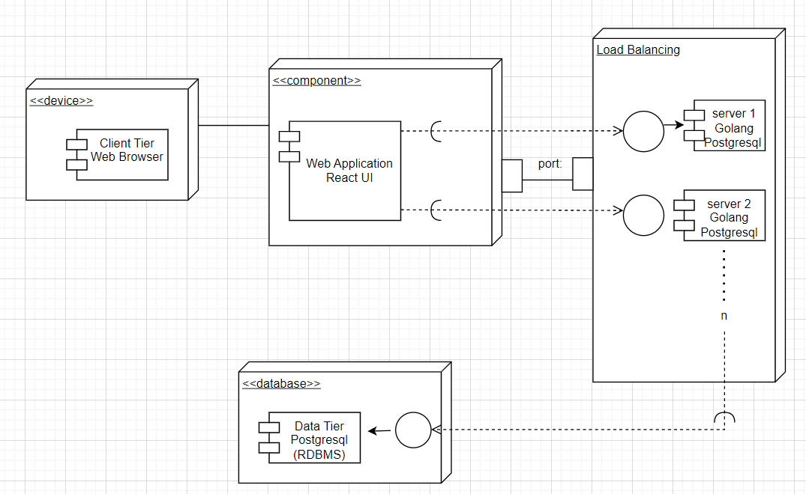
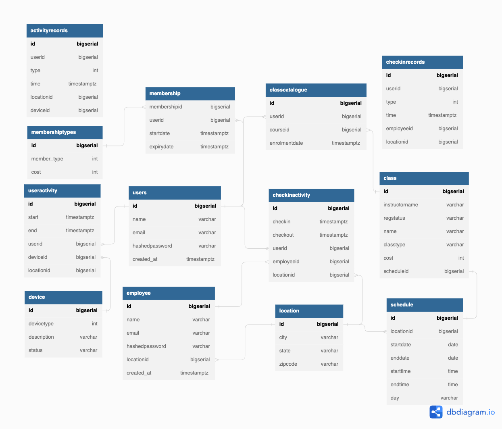
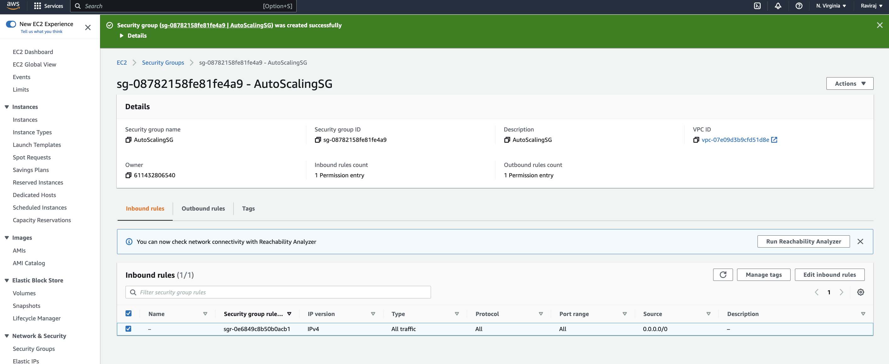
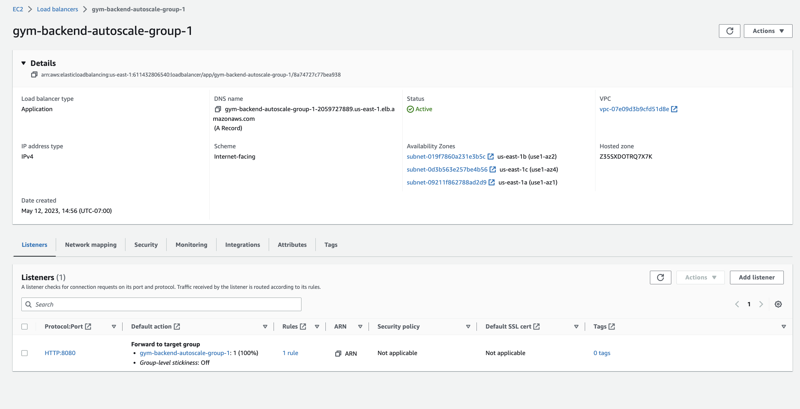
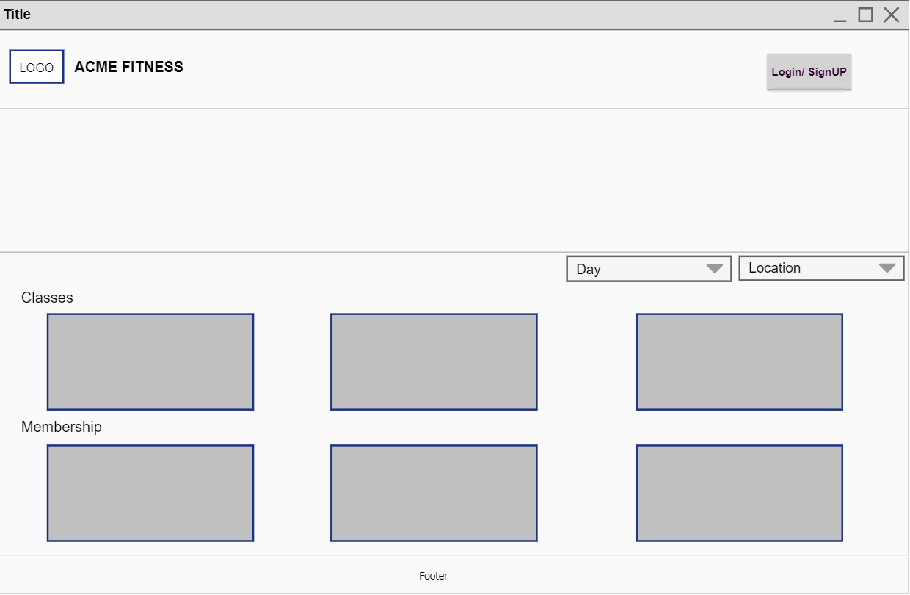
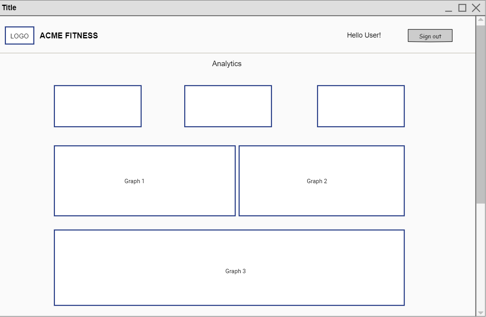

# Acme Fitness (Gym Management System)

# Tools and Technology Used:

### Frontend: React.js, NextUI
### Backend: GoLang
### Database: PostgreSQL (Deployed on Amazon RDS)
### Deployment: Amazon EC2 Auto scaled cluster with Load balancing (Deployed using Docker Image)

## Architecture Diagram:

## Deployment Diagram:

## Use Case Diagram:

## Component Diagram:

## DB Schema:

## Auto Scaled EC 2 Instances:

## Auto-scaling-instances:

## Autoscaling group:

## Load Balancer:

## UI Wireframes:

